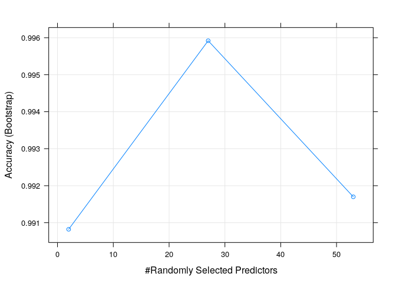
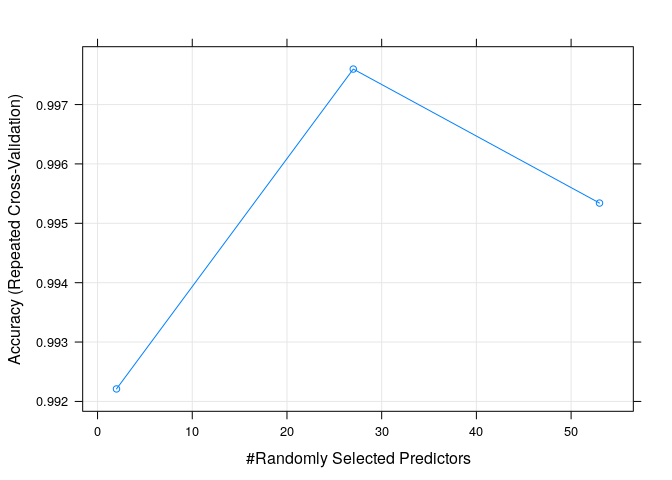
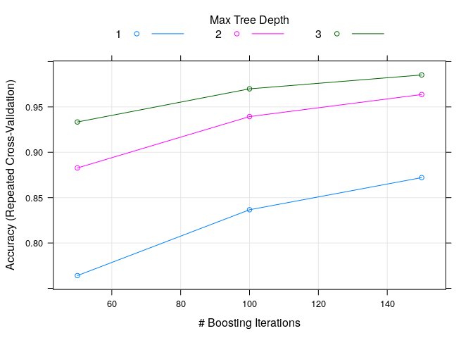

# Brief summary

This work is the project of Practical Machine Learning course. It consists of building a model that is capable of predicting the type of movement executed by six volunteers. The data consists of records recorded on accelerometers placed on different parts of the body, such as the arms, belt, forearm and dumbell. 

Training data [in this link](https://d396qusza40orc.cloudfront.net/predmachlearn/pml-training.csv)

Testing dara [in this link](https://d396qusza40orc.cloudfront.net/predmachlearn/pml-testing.csv)

More information [here](http://web.archive.org/web/20161224072740/http:/groupware.les.inf.puc-rio.br/har)

# Loading and exploring data set


```r
set.seed(987)
training <- read.csv("gaData.csv")
test_quiz <- read.csv("pml-testing.csv")
```

Omiting kurtosis and skewness because they have a lot of missing data.
timestamp variables also were removing.


```r
index <- grep("kurtosis|skewness|timestamp", names(training))
training <- training[,-index]
```

Here searching the variables with missing data, for deleteting them


```r
no_na_values <- sapply(training,function(x) sum(is.na(x)))
aux <- no_na_values[no_na_values == 0]
training <- training[,names(aux)]
training <- training[,-c(1)]
```

Deleting factors in data

In the dataset was observed that exists factors with a lot of missing values, then they were delete


```r
index_factor <- sapply(training,function(x) class(x)=="factor")
classe <- training$classe
training <- training[,names(training[,!index_factor])]
training$classe <- classe
```


# Creating training and testing data


```r
suppressMessages(library(caret))
inTrain <- createDataPartition(training$classe, p = 0.7, list = FALSE)
train_Data <- training[inTrain, ]
test_Data <- training[-inTrain, ]
```

# Building models

I chose the random forest method because I previously knew it was the most widely used method for predicting and interpreting movements in the video game industry. 
In the firts model, I decided to use the default parameters, which rule out cross validation in folds, and use the bootstrapping method with 25 repetitions.

Here is a summary of the model in r. As well as confusing chart


```r
#model_rf <- train(classe~., method = "rf", data = train_Data)
#save(model_rf,file = "mod_rf.rda")
load(file = "mod_rf.rda") # The model was previously trained previously

plot(model_rf)
```

<!-- -->

```r
model_rf
```

```
## Random Forest 
## 
## 13737 samples
##    53 predictor
##     5 classes: 'A', 'B', 'C', 'D', 'E' 
## 
## No pre-processing
## Resampling: Bootstrapped (25 reps) 
## Summary of sample sizes: 13737, 13737, 13737, 13737, 13737, 13737, ... 
## Resampling results across tuning parameters:
## 
##   mtry  Accuracy   Kappa    
##    2    0.9908210  0.9883887
##   27    0.9959182  0.9948376
##   53    0.9916993  0.9895015
## 
## Accuracy was used to select the optimal model using the largest value.
## The final value used for the model was mtry = 27.
```

```r
preds <- predict(model_rf, newdata = test_Data)
conf_rf <- confusionMatrix(preds, test_Data$classe)
conf_rf
```

```
## Confusion Matrix and Statistics
## 
##           Reference
## Prediction    A    B    C    D    E
##          A 1672    1    0    0    0
##          B    1 1138    2    0    0
##          C    0    0 1024    3    0
##          D    0    0    0  961    2
##          E    1    0    0    0 1080
## 
## Overall Statistics
##                                           
##                Accuracy : 0.9983          
##                  95% CI : (0.9969, 0.9992)
##     No Information Rate : 0.2845          
##     P-Value [Acc > NIR] : < 2.2e-16       
##                                           
##                   Kappa : 0.9979          
##                                           
##  Mcnemar's Test P-Value : NA              
## 
## Statistics by Class:
## 
##                      Class: A Class: B Class: C Class: D Class: E
## Sensitivity            0.9988   0.9991   0.9981   0.9969   0.9982
## Specificity            0.9998   0.9994   0.9994   0.9996   0.9998
## Pos Pred Value         0.9994   0.9974   0.9971   0.9979   0.9991
## Neg Pred Value         0.9995   0.9998   0.9996   0.9994   0.9996
## Prevalence             0.2845   0.1935   0.1743   0.1638   0.1839
## Detection Rate         0.2841   0.1934   0.1740   0.1633   0.1835
## Detection Prevalence   0.2843   0.1939   0.1745   0.1636   0.1837
## Balanced Accuracy      0.9993   0.9992   0.9987   0.9982   0.9990
```

The accurcy of this model is 99.83%. Possibly exist overfiting.

For comparing,another model was built, using k-folds methond in the train control


```r
#control_rf2 <- trainControl(method="repeatedcv", number=5, repeats = 1,
#                           verboseIter=FALSE)
#model_rf_2 <- train(classe~., method = "rf", data = train_Data, 
#                    trControl = control_rf2)
#save(model_rf_2, file = "mod_rf_2.rda")
load("mod_rf_2.rda") # The model was previously trained previously
model_rf_2
```

```
## Random Forest 
## 
## 13737 samples
##    53 predictor
##     5 classes: 'A', 'B', 'C', 'D', 'E' 
## 
## No pre-processing
## Resampling: Cross-Validated (5 fold, repeated 1 times) 
## Summary of sample sizes: 10990, 10989, 10990, 10990, 10989 
## Resampling results across tuning parameters:
## 
##   mtry  Accuracy   Kappa    
##    2    0.9922106  0.9901466
##   27    0.9975975  0.9969611
##   53    0.9953407  0.9941064
## 
## Accuracy was used to select the optimal model using the largest value.
## The final value used for the model was mtry = 27.
```

```r
plot(model_rf_2)
```

<!-- -->

```r
preds_rf_2 <- predict(model_rf_2, newdata = test_Data)
conf_rf2 <-confusionMatrix(preds_rf_2, test_Data$classe)
conf_rf2
```

```
## Confusion Matrix and Statistics
## 
##           Reference
## Prediction    A    B    C    D    E
##          A 1672    1    0    0    0
##          B    1 1138    2    0    0
##          C    0    0 1024    3    0
##          D    0    0    0  961    3
##          E    1    0    0    0 1079
## 
## Overall Statistics
##                                           
##                Accuracy : 0.9981          
##                  95% CI : (0.9967, 0.9991)
##     No Information Rate : 0.2845          
##     P-Value [Acc > NIR] : < 2.2e-16       
##                                           
##                   Kappa : 0.9976          
##                                           
##  Mcnemar's Test P-Value : NA              
## 
## Statistics by Class:
## 
##                      Class: A Class: B Class: C Class: D Class: E
## Sensitivity            0.9988   0.9991   0.9981   0.9969   0.9972
## Specificity            0.9998   0.9994   0.9994   0.9994   0.9998
## Pos Pred Value         0.9994   0.9974   0.9971   0.9969   0.9991
## Neg Pred Value         0.9995   0.9998   0.9996   0.9994   0.9994
## Prevalence             0.2845   0.1935   0.1743   0.1638   0.1839
## Detection Rate         0.2841   0.1934   0.1740   0.1633   0.1833
## Detection Prevalence   0.2843   0.1939   0.1745   0.1638   0.1835
## Balanced Accuracy      0.9993   0.9992   0.9987   0.9981   0.9985
```

The accuracy is 99.81% again. To compare another method it was prove  Stochastic Gradient Boosting method (gbm), included intro caret package


```r
#control_gbm <- trainControl(method = "repeatedcv", number = 5, repeats = #1)
#model_gbm  <- train(classe ~ ., data=train_Data, method = "gbm", 
#                 trControl = control_gbm, verbose = FALSE)
#save(model_gbm, file = "mod_gbm.rda")
load("mod_gbm.rda") # The model was previously trained previously

model_gbm
```

```
## Stochastic Gradient Boosting 
## 
## 13737 samples
##    53 predictor
##     5 classes: 'A', 'B', 'C', 'D', 'E' 
## 
## No pre-processing
## Resampling: Cross-Validated (5 fold, repeated 1 times) 
## Summary of sample sizes: 10989, 10990, 10990, 10990, 10989 
## Resampling results across tuning parameters:
## 
##   interaction.depth  n.trees  Accuracy   Kappa    
##   1                   50      0.7640660  0.7007645
##   1                  100      0.8366446  0.7931861
##   1                  150      0.8720970  0.8381106
##   2                   50      0.8827248  0.8514264
##   2                  100      0.9393608  0.9232657
##   2                  150      0.9636749  0.9540346
##   3                   50      0.9333913  0.9156900
##   3                  100      0.9699353  0.9619594
##   3                  150      0.9852226  0.9813077
## 
## Tuning parameter 'shrinkage' was held constant at a value of 0.1
## 
## Tuning parameter 'n.minobsinnode' was held constant at a value of 10
## Accuracy was used to select the optimal model using the largest value.
## The final values used for the model were n.trees = 150, interaction.depth =
##  3, shrinkage = 0.1 and n.minobsinnode = 10.
```

```r
plot(model_gbm)
```

<!-- -->

```r
preds_gbm <- predict(model_gbm, newdata = test_Data)

conf_gbm <-confusionMatrix(preds_gbm, test_Data$classe)
conf_gbm
```

```
## Confusion Matrix and Statistics
## 
##           Reference
## Prediction    A    B    C    D    E
##          A 1669   10    0    0    0
##          B    5 1115   15    4    4
##          C    0   12 1008   10    2
##          D    0    2    1  947   11
##          E    0    0    2    3 1065
## 
## Overall Statistics
##                                           
##                Accuracy : 0.9862          
##                  95% CI : (0.9829, 0.9891)
##     No Information Rate : 0.2845          
##     P-Value [Acc > NIR] : < 2.2e-16       
##                                           
##                   Kappa : 0.9826          
##                                           
##  Mcnemar's Test P-Value : NA              
## 
## Statistics by Class:
## 
##                      Class: A Class: B Class: C Class: D Class: E
## Sensitivity            0.9970   0.9789   0.9825   0.9824   0.9843
## Specificity            0.9976   0.9941   0.9951   0.9972   0.9990
## Pos Pred Value         0.9940   0.9755   0.9767   0.9854   0.9953
## Neg Pred Value         0.9988   0.9949   0.9963   0.9965   0.9965
## Prevalence             0.2845   0.1935   0.1743   0.1638   0.1839
## Detection Rate         0.2836   0.1895   0.1713   0.1609   0.1810
## Detection Prevalence   0.2853   0.1942   0.1754   0.1633   0.1818
## Balanced Accuracy      0.9973   0.9865   0.9888   0.9898   0.9916
```

The accuracy obtain is less than in random forest methods, narrowly. However, time trainig is significant less.

# Classification using test_quiz data

1. Random forest with default parameters


```r
test_quiz_rf <- predict(model_rf, newdata = test_quiz)
test_quiz_rf
```

```
##  [1] B A B A A E D B A A B C B A E E A B B B
## Levels: A B C D E
```

2. Random forest using 5 folds


```r
test_quiz_rf_2 <- predict(model_rf_2, newdata = test_quiz)
test_quiz_rf_2
```

```
##  [1] B A B A A E D B A A B C B A E E A B B B
## Levels: A B C D E
```

3. Stochastic Gradient Boosting using 5 folds


```r
test_quiz_gbm <- predict(model_gbm, newdata = test_quiz)
test_quiz_gbm
```

```
##  [1] B A B A A E D B A A B C B A E E A B B B
## Levels: A B C D E
```

# Conclusions

In this work three different methods were used to build a model that is able to predict the type of movement performed by volunteers in five different categories. The methods were random forests with boostrap, random forests with 5 folds, and Stochastic gradient boosting with 5 folds. All three methods achieved high levels of accuracy.  The method with the highest accuracy was the randomized forest using bootstrap for training set validation. However, Stochastic gradient method method required less time for training. With all three methods the same result was obtained by using the validation data from the quizz

